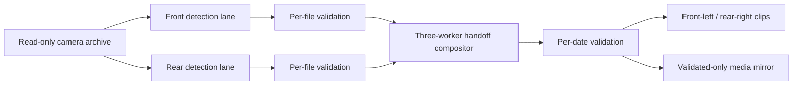

# Architecture

## Detection

`overtake_pipeline.py` decodes the source through VAAPI, samples frames, runs
YOLOv8s on the ROCm GPU and tracks objects with BoT-SORT. A vehicle candidate
must pass multi-frame confidence, duration, peak-area, scale-change, lateral
position and trajectory tests.

Rear and front cameras have different motion signatures. A likely rear pass
grows as it approaches and disappears near the rider; the corresponding front
vehicle appears and recedes. Cross traffic, short tracks and reversed motion
are rejected.

## Physical handoff alignment

Equal burned-in clock text is not enough to prove that two frames represent the
same moment. Camera clocks can have a stable bias, and long recordings may have
missing sections that change their media timelines.

`compose_paired_events.py` therefore:

1. OCRs the rear last-seen and front first-seen clocks around candidate events.
2. Estimates the stable bias between the two camera clocks.
3. Matches compatible event sequences within a 1.5-second clock residual.
4. Uses each match's own physical media offset when cutting the two views.
5. Skips ambiguous or unmatched events rather than forcing a clip.

Every combined event records the rear and front track IDs, both displayed
clocks, calibrated clock bias, residual and physical media offset.

## Composition

`compose-ready-evox3.sh` watches validated detection results. As soon as a date
has both cameras, the coordinator assigns it to a free composition worker.
Workers create 2560x720 H.264/AAC output with the front view on the left and the
rear view on the right. By default a clip spans 20 seconds before and 25 seconds
after the rear event.

## Failure model

- Reports and progress files are atomically replaced.
- Every active file/date writes a heartbeat; five minutes without movement is
  treated as a hung attempt.
- Failed evidence is archived before retry.
- Sources and dates stop after three current-version failures.
- Systemd restarts transient batch failures.
- A free-space floor is checked before and during work.
- Completed evidence is never deleted to make a retry succeed.

## Reviewed rear-only events

Some genuine passes cannot be matched safely—typically because the front
camera was absent, obscured or missing that interval. `review_skipped_events.py`
can retain strong detector evidence and recheck weaker candidates at higher
resolution. Its clips are explicitly named `rear-only-reviewed`; it never
substitutes an unrelated front view.
